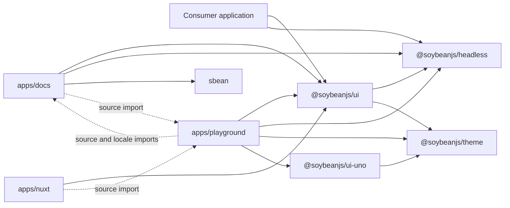
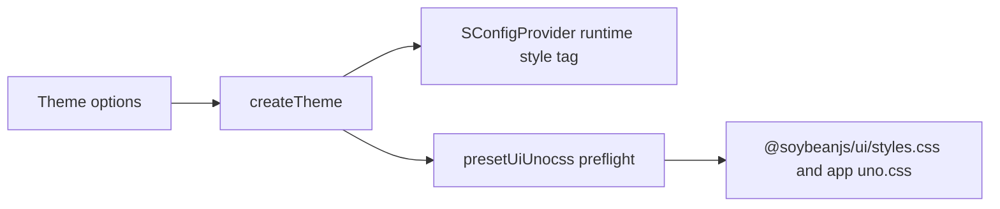
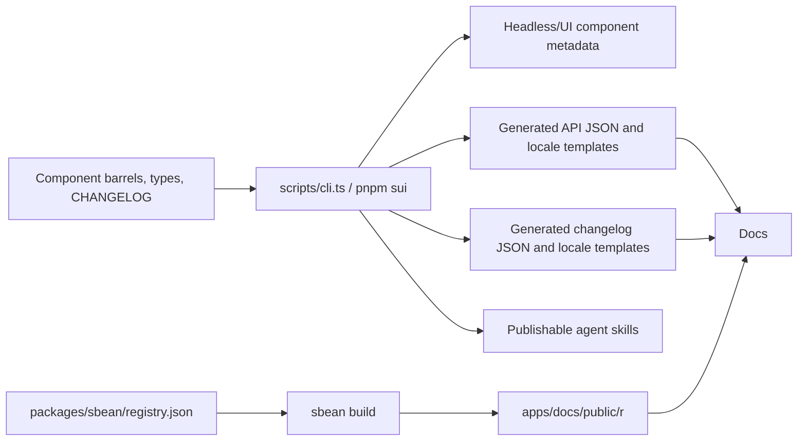

# SoybeanUI project architecture

> **Snapshot:** 2026-08-02 · repository version `0.29.3`
>
> This document describes the repository as it exists today. It is the canonical
> workspace-level architecture reference; component implementation rules remain
> in `.agents/skills/soybean-ui-component-development/`.

## 1. Evidence and scope

The architecture was reconstructed from package manifests, build/test
configuration, public entry points, generated metadata, and a CodeGraph 1.5.0
index.

- CodeGraph index status: up to date.
- Indexed scope: 2,053 TypeScript, Vue, JavaScript, and YAML files.
- Graph size: 19,293 nodes and 55,503 edges.
- Repository scope: 2,730 tracked files. Markdown, JSON, CSS, assets, and other
  files outside the graph were checked directly.
- Symbol-impact checks confirmed two important high-fanout seams:
  `useUiContext` affects 68 symbols, while `createTheme` affects 10 symbols
  across runtime UI and UnoCSS configuration.

Package manifests are the source of truth for declared package dependencies.
CodeGraph is the source used here for symbol relationships and impact analysis;
generic symbol names can be ambiguous, so graph results were cross-checked
against imports and configuration before being documented.

## 2. Repository at a glance

The pnpm workspace contains the private root project plus ten child workspaces:
seven publishable packages and three private applications.

| Area                 | Workspace                  | Purpose                                                                              |
| -------------------- | -------------------------- | ------------------------------------------------------------------------------------ |
| Component logic      | `@soybeanjs/headless`      | State, behavior, a11y, focus, keyboard interaction, locale, and unstyled composition |
| Styled components    | `@soybeanjs/ui`            | `S`-prefixed wrappers, UnoCSS recipes, theme-facing props, Nuxt module, and resolver |
| Theme engine         | `@soybeanjs/theme`         | Theme option normalization, CSS-variable generation, dark derivation, SSR/storage    |
| UnoCSS integration   | `@soybeanjs/ui-uno`        | UnoCSS preset, preflights, animations, fonts, and generated theme CSS                |
| Source distribution  | `sbean`                    | CLI, registry, schemas, templates, and MCP tools for copy-source delivery            |
| Agent distribution   | `@soybeanjs/ui-skills`     | Generated, publishable SoybeanUI and Headless agent skills                           |
| Documentation        | `@soybeanjs/ui-docs`       | Vite SSG documentation, API reference, changelog, and embedded demos                 |
| Component laboratory | `@soybeanjs/ui-playground` | Interactive examples and visual/manual component validation                          |
| Integration fixture  | `@soybeanjs/ui-nuxt`       | Thin Nuxt/UnoCSS shell over the shared playground                                    |

Current generated component inventory:

- Headless: 94 component directories, of which 92 have public component entry
  points; `_common` and `_icon` are internal. There are 27 reusable composable
  files.
- Styled UI: 88 public component groups and 110 `S`-prefixed exports.
- The generated inventories are
  `packages/headless/src/constants/components.ts` and
  `packages/ui/src/constants/components.ts`; prose counts are secondary.

## 3. Directory organization

```text
soybean-ui/
├── .agents/                 # Repository-local agent skills and workflows
├── .github/workflows/       # CI and tag-based npm release
├── .vite-hooks/             # Vite Plus git hooks
├── apps/
│   ├── docs/                # Static documentation application
│   ├── nuxt/                # Nuxt integration fixture
│   └── playground/          # Demo application and component examples
├── docs/
│   ├── architecture.md      # This workspace architecture reference
│   ├── optimize.md          # Prioritized architecture/quality assessment
│   ├── roadmap.md           # Active component roadmap
│   └── components.md        # Detailed roadmap source material
├── packages/
│   ├── _shared/             # Build helpers; not a workspace package
│   ├── admin/               # @soybeanjs/admin (backend-management composites)
│   ├── headless/            # @soybeanjs/headless
│   ├── sbean/               # sbean CLI and registry system
│   ├── theme/               # @soybeanjs/theme
│   ├── ui/                  # @soybeanjs/ui
│   └── unocss/              # @soybeanjs/ui-uno
├── scripts/                 # Metadata, API, changelog, locale, and skill generators
├── skills/                  # Generated @soybeanjs/ui-skills package
├── typings/                 # Root tool declarations
├── package.json             # Root orchestration
├── pnpm-workspace.yaml      # Workspace catalog, overrides, and install policy
└── vite.config.ts           # Vite Plus lint/format/staged/task configuration
```

`pnpm-workspace.yaml` also reserves `shared/**`, but no current workspace
project matches that pattern.

## 4. Dependency architecture

In the following diagram, `A → B` means **A depends on B**. This is distinct
from the conceptual “headless foundation, styled layer above it” description.



### 4.1 Hard package invariants

- `@soybeanjs/headless` must never import `@soybeanjs/ui`.
- `@soybeanjs/ui` imports public headless entry points; it must not depend on
  headless implementation paths.
- `@soybeanjs/theme` owns token-to-CSS generation.
- `@soybeanjs/ui-uno` adapts the theme engine to UnoCSS and must not
  become a second token authority.
- `sbean` is a source-delivery system. It owns registry resolution, templates,
  schemas, and file updates, not component runtime behavior.

### 4.2 Current source-only edges

The application graph contains edges that are not represented by workspace
manifests:

- Docs imports playground theme utilities, the theme configurator, and all demo
  SFCs through `@playground/*` and `import.meta.glob`.
- Playground imports `getOrderedPlaygroundExamples` through
  `@docs/constants/globs` and imports docs locale JSON directly.
- Nuxt imports the playground home page and theme context directly; its
  `@docs` alias is consumed transitively by that page.
- Root generation scripts import package/app implementation files directly,
  while sbean scans `packages/ui/src` as its registry source.

This creates a bidirectional source-level dependency between docs and
playground, with Nuxt layered on top of playground source. It works in the full
monorepo, but filtered builds and ownership are less obvious because pnpm
cannot model these edges. The remediation is tracked in `docs/optimize.md`.

## 5. Component architecture

### 5.1 Headless layer

`packages/headless/src/` is organized by responsibility:

- `components/`: public primitives and Compact aggregations.
- `composables/`: reusable Vue state and interaction modules.
- `shared/`: mostly pure helpers for DOM, focus, geometry, trees, forms, values,
  and comparison.
- `date/`: date and calendar helpers.
- `locale/`: locale registry and language bundles.
- `types/`: shared component, DOM, event, and class types.
- `nuxt/` and `resolver/`: framework and auto-import integrations.

“Headless” means no packaged visual theme. Behavior-critical CSS variables and
inline layout values may still be required for positioning, dimensions, focus,
or pointer interaction.

### 5.2 Styled layer

`packages/ui/src/` contains:

- `components/`: thin wrappers and UI-only compositions.
- `styles/`: `cv()` / `scv()` recipes consumed by wrappers and the UnoCSS build.
- `theme/`: shared color/size contracts and configuration context.
- `nuxt/` and `resolver/`: consumer integration entry points.
- `constants/components.ts`: generated public component inventory.

The UI layer owns visual variants and class composition. ARIA behavior, focus,
keyboard logic, and reusable state stay in headless.

### 5.3 Style-injection seam

Multi-slot components use a deliberate inversion seam:

1. A UI wrapper computes a slot-to-class map from its recipe.
2. The wrapper calls `provide{Name}Ui(ui)`.
3. Nested headless primitives read the map through an internal
   `use{Name}Ui(slot)` consumer created by `useUiContext`.

This keeps the compile-time dependency one-way (`ui → headless`) while allowing
the styled wrapper to provide visual tokens to the headless tree at runtime.
CodeGraph reports 67 component context callers of `useUiContext`, making it one
of the highest-impact internal interfaces.

### 5.4 Component shapes

- **Single-class primitive:** one root class recipe and no slot UI context.
- **Multi-slot primitive:** a typed `UiSlot`/`UiClass` map and a provided recipe.
- **Compact aggregation:** stable, data-driven composition lives in headless;
  UI remains responsible for recipes and forwarding.

The public barrel files are the intentional authoring surface. The `pnpm sui
headless` and `pnpm sui ui` commands derive generated inventories from those
barrels.

## 6. Theme and CSS architecture

The theme system has one core generator and two delivery paths:



- `createTheme` normalizes theme options and returns the generated CSS string.
- `SConfigProvider` calls it at runtime and manages the generated style tag.
- `presetUiUnocss` calls it at build time when generated UI CSS is enabled.
- Apps and the UI CSS build share the same UnoCSS preset stack.

CodeGraph reports ten affected symbols for `createTheme`, including the
UI config provider, the UnoCSS adapter, and all four repository UnoCSS configs.

## 7. Documentation, examples, and generated data

### 7.1 Documentation application

`apps/docs` is a Vue 3 Vite SSG application, not VitePress.

- `unplugin-vue-router` provides file-based routes.
- `unplugin-vue-markdown` converts Markdown to Vue pages.
- `@shikijs/markdown-exit` and Shiki handle Markdown/code rendering.
- Vue I18n combines application locales with generated API and changelog
  locale files.
- `UsageCode`, `PlaygroundGallery`, and `ComponentApi` are the main component
  documentation surfaces.

Route shells live under `src/pages/`; `DocMd` then resolves the current locale
and dynamically loads `src/docs/{locale}/{path}.md`. This makes the English and
Chinese file trees a runtime contract, not just an editorial convention.
Currently they differ at eight paths: English has `components/input-number.md`
only, while Chinese has `month-picker`, `month-range-picker`, `number-input`,
`time-picker`, `time-range-picker`, `year-picker`, and `year-range-picker`
only. The totals are 95 English files and 101 Chinese files.

### 7.2 Demo sharing

The playground owns 451 example SFC files. Docs eagerly discovers the example
components and their raw source so a single example can power both a live
preview and a code tab. This removes example duplication, but the current eager
global import and the docs/playground source cycle are scaling constraints.

### 7.3 Generated-content pipeline



Generated files are committed. They must be regenerated as one logical batch;
per-component JSON, aggregate indexes, locale templates, docs menus, and
component pages otherwise can diverge.

The local `release-execute` chain regenerates skills and changelog data, but it
does not run `pnpm sui api` or API translation. Public API freshness therefore
depends on component-delivery work or an explicit pre-release check.

## 8. Build, test, and release framework

### 8.1 Toolchain

- Package manager: pnpm 11 workspaces.
- Language: strict TypeScript and Vue SFCs.
- Build/test/lint orchestration: Vite Plus, Vue tooling, Vitest, and Rolldown
  pack configuration.
- Styling: UnoCSS, `@soybeanjs/cva`, and Lightning CSS.
- Browser validation: Vitest Browser Mode, Playwright Chromium, and axe-core.
- CLI/schema stack: Commander, Valibot, and the Model Context Protocol SDK.

Package manifests request TypeScript `7.0.2`, while the workspace override and
lockfile currently resolve `6.0.3`. Treat the lockfile value as the effective
compiler until the manifests and override are aligned.

### 8.2 Root commands

- `pnpm build`: headless → UI → sbean.
- `pnpm build:libs`: theme → ui-uno.
- `pnpm build:docs`: root build, registry generation, then docs SSG.
- `pnpm typecheck`: recursive workspace type checks.
- `pnpm test`: recursive tests for workspaces that define a test script.
- `pnpm test:e2e`: UI browser suite.
- `pnpm sui <command>`: repository generation interface.

The `prepare` script builds the theme libraries after install. Root `build`
does not currently include those libraries, so a post-edit local build can
depend on previously prepared output.

### 8.3 Test topology

At this snapshot:

- UI/headless unit suite: 106 `*.spec.ts` files under `packages/ui/test/specs`.
- Browser suite: 3 component E2E files (`button`, `dialog`, and `select`).
- sbean suite: 15 `*.spec.ts` files.
- Theme, UnoCSS preset, docs, playground, and Nuxt fixture have no dedicated
  repository test directories.

Headless behavior is primarily exercised through the UI test workspace. The
browser suite enables axe-core checks in addition to interaction assertions.
Headless and the Nuxt fixture also have no workspace-level `typecheck` script,
so recursive `pnpm typecheck` does not validate them as independent units.

### 8.4 CI and release

Pull requests and pushes to `main`/`master` run:

1. recursive typecheck;
2. lint;
3. unit tests;
4. Playwright Chromium browser tests.

CI does not currently build packages/docs or verify generated-output drift.
Tag pushes (`v*`) install, build, and publish public workspaces to npm with
provenance; the release workflow itself does not rerun unit or browser tests
and installs with `--no-frozen-lockfile`.

The tracked pre-commit hook is `.vite-hooks/pre-commit`, which runs `vp staged`.
The staged configuration applies `vp check --fix` to staged files.

## 9. Public delivery surfaces

`@soybeanjs/headless` exposes the root barrel plus `/constants`,
`/composables`, `/date`, `/locale`, `/locale/*`, `/shared`, `/nuxt`,
`/resolver`, `/namespaced`, `/types`, and per-component subpaths.

`@soybeanjs/ui` exposes its root barrel, `/nuxt`, `/resolver`, and
`/styles.css`.

`sbean` exposes its CLI plus `/registry`, `/schema`, `/preset`, `/utils`, and
`/mcp`.

Development and publication resolution differ:

- Headless development exports point to `src`; `publishConfig` maps them to
  `dist`.
- UI public exports point to `dist`, while repository apps alias
  `@soybeanjs/ui` to source for development.

## 10. Sources of truth

| Concern                       | Authoritative artifact                                                |
| ----------------------------- | --------------------------------------------------------------------- |
| Workspace membership          | `pnpm-workspace.yaml` and child `package.json` files                  |
| Version                       | root `package.json`; synchronized package versions are release output |
| Declared dependency           | the importing workspace's `package.json`                              |
| Headless public groups        | `packages/headless/src/index.ts`                                      |
| UI public groups              | `packages/ui/src/index.ts`                                            |
| Generated component inventory | each package's `src/constants/components.ts`                          |
| Component development rules   | `.agents/skills/soybean-ui-component-development/`                    |
| Unshipped-component roadmap   | `docs/roadmap.md`                                                     |
| Workspace architecture        | this document                                                         |
| Improvement backlog           | `docs/optimize.md`                                                    |

When prose conflicts with these artifacts, update the prose or add an automated
consistency check; do not create another manually maintained count.

## 11. Current architecture assessment

The strongest qualities are the explicit headless/styled seam, small theme
generator interface, generated delivery surfaces, strict typing, broad unit
suite, and a dedicated source-distribution CLI.

The highest-value improvements are:

1. make every direct workspace dependency explicit and reduce reliance on
   global hoisting;
2. add build/package/generated-drift checks to pull-request CI;
3. remove the docs/playground source cycle and lazy-load or pre-generate demo
   catalogs;
4. move runtime API-source parsing into the generation pipeline;
5. add direct contract tests around the theme and style-context seams.

Evidence, severity, acceptance criteria, and sequencing are maintained in
[`docs/optimize.md`](./optimize.md).
